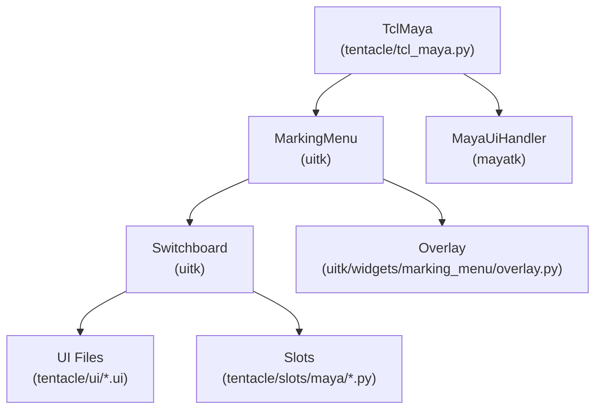

[](test/)
[](https://www.gnu.org/licenses/lgpl-3.0.en.html)
[](https://pypi.org/project/tentacletk/)

# Tentacle: A Python3/qtpy Marking Menu

Tentacle is a Python/qtpy marking menu runtime for DCC applications, built on top of `uitk`.
It currently ships a full slot ecosystem for Maya (tested with Maya 2025), with wrapper entry points for Blender and 3ds Max.

## Design

Tentacle runs on top of [uitk](https://github.com/m3trik/uitk.git), which provides:

- Dynamic `.ui` loading via `Switchboard`
- Convention-based slot binding (`widget_name -> slot method`)
- The marking-menu engine (`MarkingMenu`) and gesture path overlay (`Overlay`)

## Example

The following example demonstrates re-opening the last scene, renaming a material, and selecting geometry by that material.


## Structure

Current architecture overview:



| Module        | Description   |
| ------------- | ------------- |
| [tentacle/tcl_maya.py](../tentacle/tcl_maya.py) | Maya entry point and default key/button bindings for the marking menu. |
| [tentacle/slots](../tentacle/slots) | Slot classes containing command logic (Maya-focused). |
| [tentacle/ui](../tentacle/ui) | Dynamic `.ui` definitions for start menus and submenus. |
| [uitk/widgets/marking_menu/_marking_menu.py](../../uitk/uitk/widgets/marking_menu/_marking_menu.py) | Core marking menu engine (input state, transitions, window handling). |
| [uitk/widgets/marking_menu/overlay.py](../../uitk/uitk/widgets/marking_menu/overlay.py) | Gesture/path overlay used for submenu path continuity and drawing. |

## Installation

Tentacle can be installed either using pip directly in the command line or by downloading and running mayapy package manager in Windows.

### Installation via pip

Install via pip in a command line window using:

```bash
path/to/mayapy.exe -m pip install tentacletk
```

### Installation Using Mayapy Package Manager

Alternatively, you can use the mayapy package manager for a streamlined installation process. 
Download the mayapy package manager from [here](https://github.com/m3trik/windows-shell-scripting/blob/master/mayapy-package-manager.bat). (Give your Maya version. Hit 1 to install package. The package name is `tentacletk`)

## Usage

To launch the marking menu:

For Maya, add the following to your `userSetup.py`:

```python
import pymel.core as pm

def start_tentacle():
    from tentacle import TclMaya
    TclMaya(key_show='Key_F12')  # Use Qt key names, e.g. Key_F12

pm.evalDeferred(start_tentacle)
```

## Menu Wiring (How It Works)

Tentacle uses naming conventions between UI widgets and slot methods:

- UI file names determine menu identity (example: `materials.ui`, `main#startmenu.ui`)
- Widget object names map to methods in the matching slots class
    - `b005` -> `def b005(...)`
    - `cmb002` -> `def cmb002(...)`
    - Optional setup hooks: `def cmb002_init(widget)`
- "Info" buttons (`i*`) route by `accessibleName` to submenu UIs

This wiring is handled by `uitk` `Switchboard` + `MarkingMenu`.

## Platform Support

- Maya: full menu and slot coverage
- Blender: wrapper class exists (`TclBlender`), no equivalent slot suite in this repo
- 3ds Max: wrapper class exists (`TclMax`), no equivalent slot suite in this repo
