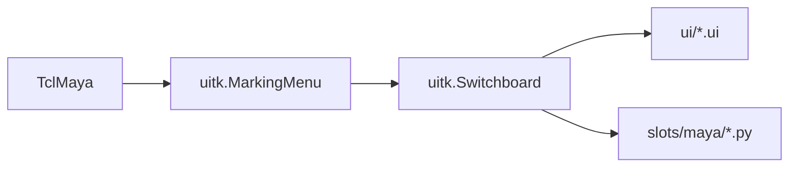

[](test/)
[](https://www.gnu.org/licenses/lgpl-3.0.en.html)
[](https://pypi.org/project/tentacletk/)

# Tentacle

A Qt marking-menu (pie-menu) launcher for DCC apps. Hold a hotkey, flick toward a wedge, release — the tool runs. Submenus open along the gesture path.

Tentacle is the Maya-flavored shell on top of [`uitk.MarkingMenu`](../../uitk/uitk/widgets/marking_menu/_marking_menu.py). It ships ~60 Maya tool panels (modeling, UV, materials, rigging, animation, rendering, …) and wrapper entry points for Blender and 3ds Max.


## Install

```bash
"C:/Program Files/Autodesk/Maya2025/bin/mayapy.exe" -m pip install tentacletk
```

Or use the bundled [mayapy package manager](https://github.com/m3trik/mayatk/blob/master/mayatk/env_utils/mayapy-package-manager.bat) — pick your Maya version, press `1`, type `tentacletk`.

Requires Python 3.9+ and Qt via `qtpy` (PySide2 or PySide6). The upstream toolkit packages [`pythontk`](https://github.com/m3trik/pythontk), [`uitk`](https://github.com/m3trik/uitk), and [`mayatk`](https://github.com/m3trik/mayatk) are pulled in automatically.

## Launch

In Maya's `userSetup.py`:

```python
from maya.utils import executeDeferred

def start_tentacle():
    from tentacle import TclMaya
    TclMaya(key_show="Z")

executeDeferred(start_tentacle)
```

`key_show` accepts bare keys (`"Z"`, `"Space"`) or Qt names (`"Key_Z"`); if omitted it defaults to `F12`.

## Bindings

Defined in [`tcl_maya.py`](../tentacle/tcl_maya.py); chords are parsed by `uitk.MarkingMenu` (see [`uitk/docs/MARKING_MENU.md`](../../uitk/docs/MARKING_MENU.md)). The table below assumes `key_show="Z"` from the example — substitute your chosen key.

| Chord                                | Opens                 |
| ------------------------------------ | --------------------- |
| `Z`                                | `hud#startmenu`       |
| `Z + LMB`                          | `cameras#startmenu`   |
| `Z + MMB`                          | `editors#startmenu`   |
| `Z + RMB`                          | `main#startmenu`      |
| `Z + LMB + RMB`                    | `maya#startmenu`      |

`Ctrl+Shift+R` repeats the last command (configurable in **Preferences**).

## How it works


```mermaid
flowchart LR
    A[TclMaya] --> B[uitk.MarkingMenu]
    B --> C[uitk.Switchboard]
    C --> D[ui/*.ui]
    C --> E[slots/maya/*.py]
```

`uitk.Switchboard` pairs each `.ui` file with a slot module **of the same basename**, then connects each widget's `objectName` to a method of the same name on the slot class:

```
ui/materials.ui          ──pairs with──►   slots/maya/materials.py
  └─ widget objectName "b005"  ──calls──►    def b005(self): ...
  └─ widget objectName "b005"  ──setup──►    def b005_init(self, widget): ...  (optional)
```

That's the whole convention. Widget object names are arbitrary; whatever name a widget has, a method of that name on the slot class will fire when it's interacted with.

Submenu routing: a widget's `accessibleName` (e.g. `"cameras#lower"`) names the submenu UI to open when the gesture lands on it.

## Customization

```python
TclMaya(
    key_show="F11",
    slot_source="my_studio/slots",   # use your own slot library
    log_level="DEBUG",
    bindings={                        # replace defaults entirely
        "Key_F11":               "main#startmenu",
        "Key_F11|RightButton":   "cameras#startmenu",
    },
)
```

User preferences (theme, repeat-last shortcut, etc.) live in the in-app **Preferences** panel.

## Project layout

```
tentacle/
├── tcl_maya.py            TclMaya entry point + default bindings
├── tcl_max.py             TclMax  (wrapper, no slot library yet)
├── tcl_blender.py         TclBlender (wrapper, no slot library yet)
├── slots/
│   ├── _slots.py          Slots base — repeat-last-command shortcut
│   └── maya/              ~60 SlotsMaya subclasses
└── ui/                    .ui definitions; maya_menus/ holds Maya submenus
```

## Platform support

| DCC         | Status                                                 |
| ----------- | ------------------------------------------------------ |
| Maya 2025+  | Full — entry point, slot library, all menus wired.     |
| Blender     | Wrapper only ([`TclBlender`](../tentacle/tcl_blender.py)). |
| 3ds Max     | Wrapper only ([`TclMax`](../tentacle/tcl_max.py)).         |

## Development

```bash
git clone https://github.com/m3trik/tentacle
pip install -e ./tentacle
cd tentacle && python -m pytest test/
```

CI runs `test_package.py`, `test_slot_integrity.py`, `test_ui_integrity.py`, and module-specific suites — see [`.github/workflows/tests.yml`](../.github/workflows/tests.yml).

## More

- [`API_REGISTRY.md`](../API_REGISTRY.md) — every public class/method, with file:line links.
- [`CHANGELOG.md`](../CHANGELOG.md) — notable changes.
- [`CLAUDE.md`](../CLAUDE.md) — contributor conventions.
- [`uitk/docs/MARKING_MENU.md`](../../uitk/docs/MARKING_MENU.md) — chord syntax, gesture mechanics.

## License

[LGPL v3](https://www.gnu.org/licenses/lgpl-3.0.en.html).
