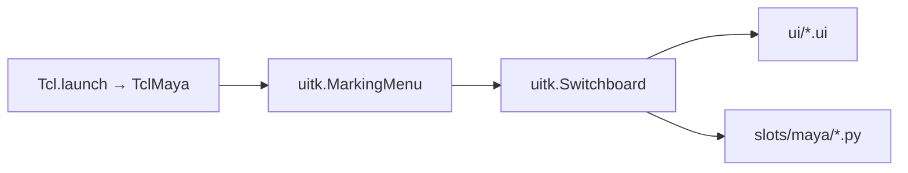

[](../test/)
[](https://www.gnu.org/licenses/lgpl-3.0.en.html)
[](https://pypi.org/project/tentacletk/)

# Tentacle

A Qt marking-menu launcher for DCC apps.

Built on [`uitk.MarkingMenu`](https://github.com/m3trik/uitk/blob/main/uitk/widgets/marking_menu/_marking_menu.py), it ships ~60 Maya tool panels spanning the full pipeline (modeling, UV, materials, rigging, animation, rendering, …) — a starting set you can build on, or replace wholesale with your own — a Blender integration slot library is in progress, and a thin 3ds Max wrapper exists to build on.


## Install

Install from a command prompt, into your DCC's own Python (not a system install). The commands below name specific versions — adjust the paths to match yours.

**Maya** (2025+) — install into `mayapy`:

```bash
"C:/Program Files/Autodesk/Maya2025/bin/mayapy.exe" -m pip install tentacletk
```

**Blender** (4.x+) — same package, into Blender's bundled Python:

```bash
"C:/Program Files/Blender Foundation/Blender 5.1/5.1/python/bin/python.exe" -m pip install tentacletk
```

Prefer a menu? Download and run the package manager for your DCC — [mayapy-package-manager.bat](https://github.com/m3trik/mayatk/blob/master/mayatk/env_utils/mayapy-package-manager.bat) / [blenderpy-package-manager.bat](https://github.com/m3trik/blendertk/blob/master/blendertk/env_utils/blenderpy-package-manager.bat) — pick your DCC version, choose *Install Package*, type `tentacletk`.

## Launch

The same two lines start Tentacle in any supported DCC — `Tcl.launch` detects the host and defers startup however that host needs:

```python
from tentacle import Tcl
Tcl.launch(key_show="Z")
```

`key_show` is the key you hold to open the menu. Pick one now — bare (`"Z"`, `"Space"`) or Qt-named (`"Key_F11"`) — since while Tentacle is running its key takes precedence over the DCC's own binding on that key.

Naming a key sets the **default**: it applies on a first run and for as long as you haven't picked a key yourself. A key you set from the UI ([Bindings](#bindings)) is remembered and takes precedence over it from then on. With no argument the default is `Z`.

Save the snippet where your DCC looks for startup code:

| DCC | Put it in |
| --- | --- |
| Maya | `userSetup.py` (in `~/Documents/maya/<version>/scripts/`) |
| Blender | `startup.py` in `%APPDATA%\Blender Foundation\Blender\<version>\scripts\startup\` |

Restart the DCC, hover the viewport, and hold your key.

`Tcl.launch` recognizes 3ds Max too and starts `TclMax` there — the menu opens, but its slot library isn't ported yet, so the panels have no behavior wired. See [Platform support](#platform-support).

## Bindings

Holding the activation key opens a menu; adding mouse buttons picks which one. Shown with the default `Z`:

| Chord                                | Opens                 |
| ------------------------------------ | --------------------- |
| `Z`                                | `hud#startmenu`       |
| `Z + LMB`                          | `cameras#startmenu`   |
| `Z + MMB`                          | `editors#startmenu`   |
| `Z + RMB`                          | `main#startmenu`      |
| `Z + LMB + RMB`                    | `maya#startmenu`      |

(In Blender the both-button chord opens `blender#startmenu` — the native menu sets.)

To change the activation key later, use the in-app **Preferences** panel or the shortcut editor's *Show Marking Menu* row — or, in Blender, *Preferences ▸ Keymap* ▸ `3D View` ▸ *Tentacle Marking Menu*. Either way the whole chord table moves with it and the choice is remembered, outranking the `key_show` default your launch script names.

The table is built in [`tcl.py`](../tentacle/tcl.py); chord syntax, gesture mechanics, and the full customization surface are covered in [`uitk/docs/MARKING_MENU.md`](https://github.com/m3trik/uitk/blob/main/docs/MARKING_MENU.md).

## How it works


```mermaid
flowchart LR
    A[Tcl.launch → TclMaya] --> B[uitk.MarkingMenu]
    B --> C[uitk.Switchboard]
    C --> D[ui/*.ui]
    C --> E[slots/maya/*.py]
```

`uitk.Switchboard` pairs each `.ui` file with a slot module **of the same basename**, then connects each widget's `objectName` to a method of the same name on the slot class:

```
ui/materials.ui          ──pairs with──►   slots/maya/materials.py
  └─ widget objectName "b005"  ──calls──►    def b005(self): ...
  └─ widget objectName "b005"  ──setup──►    def b005_init(self, widget): ...  (optional)
```

That's the whole convention. Widget object names are arbitrary; whatever name a widget has, a method of that name on the slot class will fire when it's interacted with.

Submenu routing: a widget's `accessibleName` (e.g. `"cameras#lower"`) names the submenu UI to open when the gesture lands on it.

## Customization

`Tcl.launch` forwards anything extra to the DCC's entry class:

```python
Tcl.launch(
    key_show="F11",
    slot_source="my_studio/slots",   # use your own slot library
    log_level="DEBUG",
    bindings={                        # replace defaults entirely
        "Key_F11":               "main#startmenu",
        "Key_F11|RightButton":   "cameras#startmenu",
    },
)
```

User preferences (theme, repeat-last shortcut, etc.) live in the in-app **Preferences** panel.

## Project layout

```
tentacle/
├── tcl.py                 Tcl.launch — host detection + the shared activation-key/chord contract
├── tcl_maya.py            TclMaya entry point
├── tcl_max.py             TclMax  (wrapper, no slot library yet)
├── tcl_blender.py         TclBlender entry point — Qt host + keymap bridge + launcher + add-on
├── slots/
│   ├── _slots.py          Slots base — repeat-last-command shortcut
│   ├── maya/              ~60 SlotsMaya subclasses
│   └── blender/           SlotsBlender subclasses (Phase 3+)
└── ui/                    .ui definitions; maya_menus/ + blender_menus/ hold DCC submenus
```

## Platform support

| DCC         | Status                                                 |
| ----------- | ------------------------------------------------------ |
| Maya 2025+  | Full — entry point, slot library, all menus wired.     |
| Blender     | Entry point + keymap activation live ([`TclBlender`](../tentacle/tcl_blender.py)); slot port in progress. |
| 3ds Max     | Wrapper only ([`TclMax`](../tentacle/tcl_max.py)).         |

## Development

```bash
git clone https://github.com/m3trik/tentacle
pip install -e ./tentacle
cd tentacle && python -m pytest test/
```

CI runs `test_package.py`, `test_slot_integrity.py`, `test_ui_integrity.py`, and module-specific suites — see [`.github/workflows/tests.yml`](../.github/workflows/tests.yml).

## More

- [`API_REGISTRY.md`](../API_REGISTRY.md) — every public class/method, with file:line links.
- [`CHANGELOG.md`](../CHANGELOG.md) — notable changes.
- [`CLAUDE.md`](../CLAUDE.md) — contributor conventions.
- [`uitk/docs/MARKING_MENU.md`](https://github.com/m3trik/uitk/blob/main/docs/MARKING_MENU.md) — chord syntax, gesture mechanics.

## License

[LGPL v3](https://www.gnu.org/licenses/lgpl-3.0.en.html).
